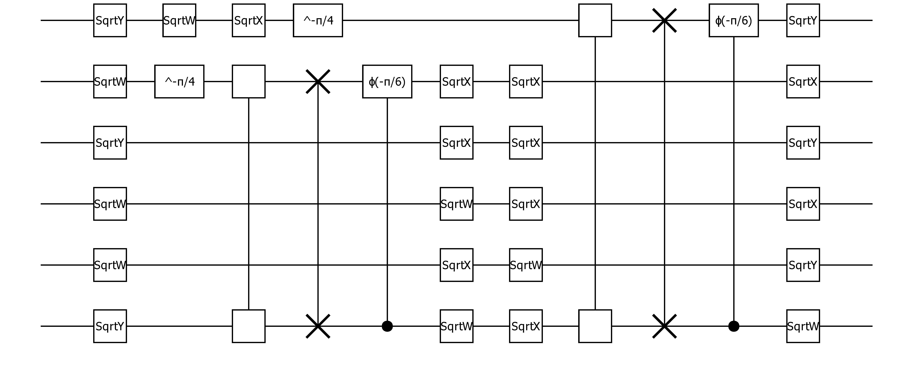

# Supplement for the paper - Efficient and Portable Einstein Summation in SQL

## Quantum Circuits
We use Julia to create the quantum circuts: 
````commandline
using YaoExtensions, YaoPlots, Yao
using Compose, Cairo
circuit = Yao.EasyBuild.rand_google53(4, nbits=6);
vizcircuit(circuit) |> Compose.PDF("circuit_4_6.pdf")
````
which creates the following circuit.



If you are interested in understanding the building blocks of this circuit
we would suggest you reading https://yaoquantum.org/tutorials/getting-started/1-introduction/.

This circut be transformed into a tensornetwork. For this circuit we get the einstein notation:
````python
'a,b,c,d,e,f,ga,hb,ic,jd,ke,lf,mnhl,og,pm,qi,rj,sk,tn,uo,vp,wq,xr,ys,zt,ABuz,CA,Dv,Ew,Fx,Gy,HB->CDEFGH'
````

and the tensors
````python
import numpy as np
T0 = np.array([1.+0.j,0.+0.j])
T1 = np.array([[ 0.5+0.5j,-0.5-0.5j], [ 0.5+0.5j, 0.5+0.5j]])
T2 = np.array([[ 0.70710678-0.j, -0.5-0.5j], [ 0.5-0.5j, 0.70710678-0.j]])
T3 = np.array([[[[1.00000000e+00+0.j, 0.00000000e+00+0.j], [0.00000000e+00+0.j, 0.00000000e+00+0.j]],
        [[0.00000000e+00+0.j, 6.12323400e-17+0.j], [0.00000000e+00-1.j, 0.00000000e+00+0.j]]],
        [[[0.00000000e+00+0.j, 0.00000000e+00-1.j], [6.12323400e-17+0.j, 0.00000000e+00+0.j]],
         [[0.00000000e+00+0.j, 0.00000000e+00+0.j], [0.00000000e+00+0.j, 8.66025404e-01-0.5j]]]])
T4 = np.array([[0.5+0.5j, 0.5-0.5j], [0.5-0.5j, 0.5+0.5j]])
````

For the einstein compuatation we use `opt_einsum` as
````python
import opt_einsum as oe
oe.contract("a,b,c,d,e,f,ga,hb,ic,jd,ke,lf,mnhl,og,pm,qi,rj, \
    sk,tn,uo,vp,wq,xr,ys,zt,ABuz,CA,Dv,Ew,Fx,Gy,HB->CDEFGH", 
    T0,T0,T0,T0,T0,T0,T1,T2,T2,T1,T1,T2,T3,T1,T1,T1,T4,T2,T1,T4,T4,
    T1,T2,T1,T4,T3,T4,T2,T1,T4,T4,T1)
````